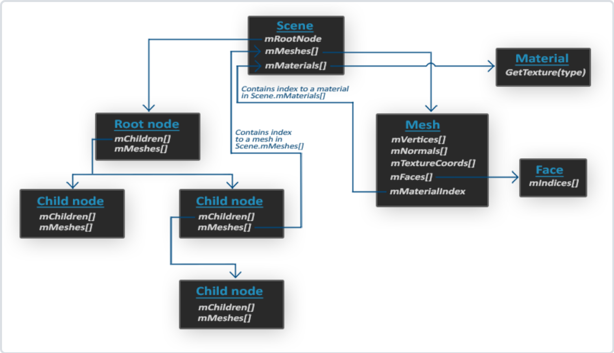

# 关于Assimp库的笔记
## Assimp读取obi，mtl文件产生的数据结构
* loadscene函数返回一个aiScene对象，这个对象包含了所有的模型数据，包括顶点，法线，纹理坐标，材质，动画等等。scene对象包含rootnode、各mesh对象的实际数组、各material对象的实际数组
  > 使用节点的最初想法是将网格之间定义一个父子关系。通过这样递归地遍历这层关系，我们就能将某个网格定义为另一个网格的父网格了。
这个系统的一个使用案例是，当你想位移一个汽车的网格时，你可以保证它的所有子网格（比如引擎网格、方向盘网格、轮胎网格）都会随着一起位移。这样的系统能够用父子关系很容易地创建出来。

* aiMesh对象包含了一个网格的所有数据，包括顶点，法线，纹理坐标，材质，动画等等。mesh对象包含顶点数组、法线数组、纹理坐标数组、面数组、材质索引、骨骼数组、动画数组。当然我们这里没用到那么多。
  * 纹理坐标数组是一个二维数组，`mTextureCoords[i][j]`应该表示第j个顶点在第i个纹理上的纹理坐标，我们的程序中只使用了第一组。
  * `mFaces`数组表示当前mesh的各face，即primitive，面元，我们这里的obj文件的面元为三角形，所以`mFaces`数组中的每个元素`Face`都包含三个顶点的索引，即`mFaces[i].mIndices[j]`表示第i个面元的第j个顶点的索引。当然face也可以四边形。
  * `mMaterialIndex`表示当前mesh使用的材质的索引，即`scene->mMaterials[mesh->mMaterialIndex]`表示当前mesh使用的材质。材质信息在mtl文件中给出，包含使用的漫反射纹理，镜面反射纹理，法线贴图纹理、反光度(即`struct material`中的`shininess`)和物体表面对光的反射率(即`struct material`中的各energy变量)等信息。每个material都会有多个纹理。

## 我们编写的Mesh和Model类
* 我们在Model类中加载整个场景，即`scene = importer.ReadFile(path, aiProcess_Triangulate | aiProcess_FlipUVs);`，然后递归地遍历每个node，将每个mesh的数据存储到一个Mesh类中。
* 在Mesh类中，存有当前mesh的顶点数组、索引数组、纹理数组以及mesh的材质。在建立Mesh时我们便将顶点各信息都绑定了到VAO上。在Draw函数中，我们将材质的各信息传递给shader，然后绑定纹理，绘制当前mesh。因为在编写shader时不知道有多少个纹理，所以我们规定了各纹理的命名规则以及最大值，即`texture_diffuseN`、`texture_specularN`。**在我们的主程序中，建立Model之后，我们无需set模型本身有关的数据，set其它数据之后调用`Model.Draw()`即可**
* **要注意的是**教程里这个代码要加载其他obj模型必须要带有相应的mtl文件，而且obj模型的所有模型部件都必须至少有一个漫反射贴图，
也就是说，这份代码不支持没有贴图的模型（哪怕是只有一小部分没有贴图），网上很多的模型，比如一个汽车的模型，汽车是黑色的，
通常建模者会给整个车体指定一种黑色高光材质，而没有贴图（这样是为了节约资源，如果想要表现车身上的磨损生锈这样的细节效果，通常会做一个贴图），
然而代码中没有考虑这样的情况，所以程序很可能会在读取模型processMesh函数那里崩溃。所以要读取这样的模型你可能要稍微修改一下代码，
考虑没有贴图的情况（但是mtl文件还是得有，里面存有材质信息，obj本身没有材质信息；
当然你还可以修改代码考虑没有mtl文件的情况下加载一个默认的材质），但是对于有贴图的模型，本人测试大部分obj模型还是支持得很好的
至于很多人的纹理加载不出来可能是mtl文件里的贴图路径问题，mtl本身是一个文本文件，可以用记事本打开，
把一些贴图的绝对路径比如C://tex1.jpg这样的修改成 tex1.jpg这样的相对路径，然后把贴图和模型扔在同一个文件夹里应该就能正常读取了。
所以我们这里编写的Mesh和Model类实际上不是通用的，取决于我们需要从obi、mtl文件中读取哪些模型数据。

## 编译Assimp库
* 下载Assimp库，解压，进入解压后的目录，新建一个build文件夹，进入build文件夹，执行`cmake ..`，然后执行`make`，在build/code目录中产生我们需要的.dll文件和.a文件。在cmake时注意选择编译器，我这里选择的是MinGW Makefiles，因为我使用的是MinGW编译器，最好也指定自己电脑上的gcc编译器。因为我这里使用vscode，所以在添加完.dll和.a文件之后，在task.json中添加`-lassimp`参数。这之后才能正常编译执行。
* 整体的编译命令`g++.exe -g C:\D\ZJU\learn\31\cg\lab\src\learn\mesh\learn_openGL_mesh.cpp C:\D\ZJU\learn\31\cg\lab/lib/src/*.cpp -o C:\D\ZJU\learn\31\cg\lab/DeBug/learn_openGL_mesh.exe -I C:\D\ZJU\learn\31\cg\lab/include/ -L C:\D\ZJU\learn\31\cg\lab/lib/ -lopengl32 -lgl -lglfwdll -lassimp`
  * `-I`指定头文件目录
  * `-L`指定库文件目录
  * `-l`指定库文件名,库文件的命名规定为libxxxx.dll(.a)。libxxxx.a等价于-lxxxx,libxxxx.dll等价于-lxxxx。编译时，若参数有-lxxxx，则编译器会在指定的库文件目录下寻找libxxxx.dll(.a)文件。编译器会优先链接动态库，若要链接静态库，需要在编译时加上-static参数。静态库和动态库都可以由.o文件生成。
> 在我的编译命令中，-lopengl32 -lgl -lglfwdll -lassimp 这些参数告诉链接器需要链接哪些库。链接器会在 -L 参数指定的目录中查找这些库。
在Windows系统中，链接器会首先查找 .lib 文件。如果找到，它会链接这个 .lib 文件。.lib 文件可能是静态库，也可能是动态链接库的导入库。如果 .lib 文件是动态链接库的导入库，那么在运行时，程序会尝试加载对应的 .dll 文件。运行时的动态链接库（DLL）位置，通常需要在系统的 PATH 环境变量中指定，或者将 DLL 文件放在可执行文件（EXE）的同一目录下
如果链接器没有找到 .lib 文件，它会尝试查找 .dll 文件，并直接链接 .dll 文件。但这通常需要特殊的链接器支持，并不是所有的链接器都支持这种方式。

